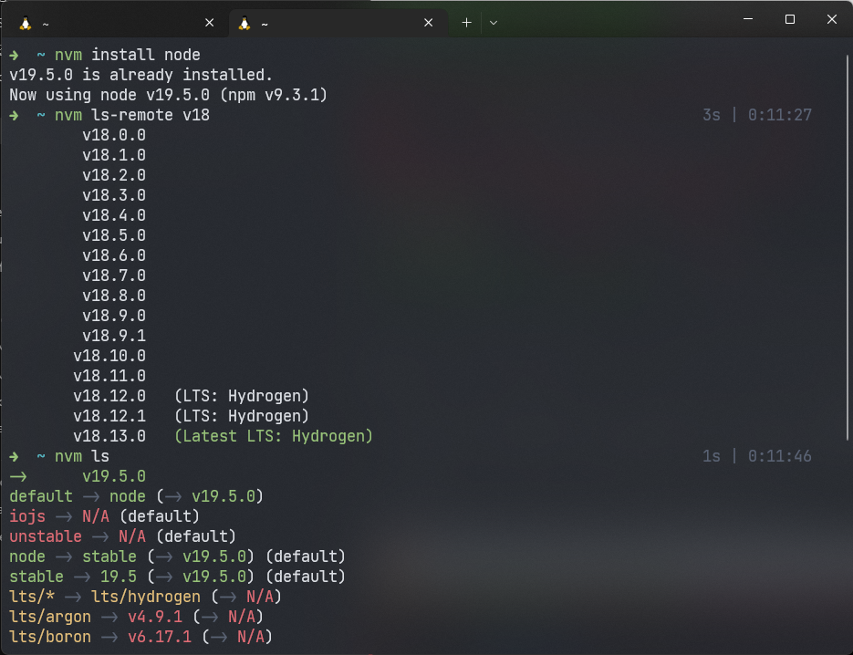
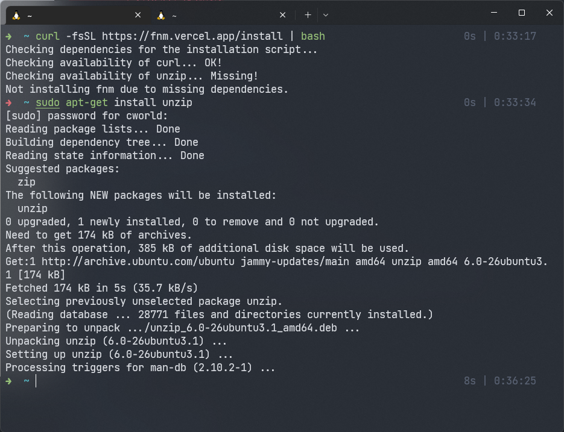

Node.js® is an open-source, cross-platform JavaScript runtime environment.

<!-- more -->

## nvm

无论选择在 Windows 还是在 WSL 上安装，安装 Node.js 时还要作出其他选择。 建议使用版本管理器，因为版本变更速度非常快。 你可能需要根据所使用的不同项目的需求在多个版本的 Node.js 之间进行切换。 Node 版本管理器（通常称为 nvm）是安装多个版本的 Node.js 的最常见方法。 我们将演练安装 nvm 的步骤，然后使用它来安装 Node.js。

### 安装 nvm

要安装或更新 nvm，应运行安装脚本。为此，您可以手动下载并运行该脚本，或者使用以下 cURL 或 Wget 命令：

```bash
curl -o- https://raw.githubusercontent.com/nvm-sh/nvm/v0.39.3/install.sh | bash
```

```bash
wget -qO- https://raw.githubusercontent.com/nvm-sh/nvm/v0.39.3/install.sh | bash
```

运行上述任一命令都会下载并运行脚本。该脚本将 nvm 仓库克隆到 `~/.nvm`，并尝试将以下代码片段中的源代码追加到正确的配置文件（`~/.bash_profile`、`~/.zshc`、`~/.profile` 或 `~/.bashrc`）中。

```bash
export NVM_DIR="$HOME/.nvm"
[ -s "$NVM_DIR/nvm.sh" ] && \. "$NVM_DIR/nvm.sh"  # This loads nvm
[ -s "$NVM_DIR/bash_completion" ] && \. "$NVM_DIR/bash_completion"  # This loads nvm bash_completion
```


### 验证 nvm

使用命令：

```bash
command -v nvm
```

或者，`nvm -v` 也许是个不错的检查方式。


> 在 Linux 上，运行安装脚本后，如果您在键入 `command -v nvm` 后收到 `nvm: command not found` 或看不到来自终端的反馈，只需关闭当前终端，并重新打开新终端，然后再次尝试验证即可。 或者，您可以在命令行上为不同的 shell 运行以下命令：
>
> - _bash_: `source ~/.bashrc`
> - _zsh_: `source ~/.zshrc`
> - _ksh_: `. ~/.profile`
>
> 嗯...希望你能看懂我在说什么。

### nvm 用法

想要下载、编译和安装最新版本的 node，你可以直接执行：

```bash
nvm install node # "node" is an alias for the latest version
nvm install --lts # 使用 LTS 版本更适合生产应用程序，避免问题
```

安装一个特定版本的 node：

```bash
nvm install 14.7.0 # or 16.3.0, 12.22.1, etc
```

你安装的第一个版本会被设置为默认版本。所有新的终端将使用默认版本的 node 作为起始。你也可以使用 `nvm default v18.13.0` 切换。卸载对应版本请使用：

```bash
nvm uninstall --version 18.13.0
```

使用命令 `ls-remote` 会列出所有 nvm 能够提供的 node 版本。列表会比较长，你可以使用 `vxx` 关键字简单过滤：

```bash
nvm ls-remote v18
```

然后在任何新的 shell 里使用安装的版本：

```bash
nvm use node
nvm use v18.13.0
```

或者单纯一次性的使用某个版本运行一下：

```bash
nvm run node --version
```

以及别忘了 `which` 命令：

```bash
nvm which 12.22
```



### 移除 nvm

nvm 固然好用，但接下来讲的另外一个工具也许能让你怦然心动，恰巧是 nvm 的优秀替代品。如果你需要换到接下来的工具或者其他工具，也可尝试移除 nvm。

首先移除整个库（也就是之前提到的 `.nvm`）：

```bash
rm -rf "$NVM_DIR"
```

然后前往你的配置文件（也就是之前提到的如 `.zshrc` 文件），移除对应的环境变量声明文本（大概长下边这样）：

```bash
export NVM_DIR="$HOME/.nvm"
[ -s "$NVM_DIR/nvm.sh" ] && \. "$NVM_DIR/nvm.sh" # This loads nvm
[[ -r $NVM_DIR/bash_completion ]] && \. $NVM_DIR/bash_completion
```

## fnm

[fnm](https://github.com/Schniz/fnm)（Fast Node Manager）基于 Rust 开发，是不是还没用就感觉到它的快了，哈哈~  
同时，它是跨平台的，支持 macOS、Linux、Windows。

### 安装

```bash
curl -fsSL https://fnm.vercel.app/install | bash
```

如果你像笔者这样报错的话，可能是缺失了 `unzip`，直接安装一下即可：

```
sudo apt-get install unzip
```



### 验证 fnm

```bash
command -v fnm

# 或者使用这一句
fnm --version
```

### fnm 用法

Quick start：

```bash
# 1. 安装最新的 LTS 版本
fnm install --lts
# Installing Node v18.13.0 (arm64)

# 2. 设置为全局默认版本
fnm default 18

# 3. 尽情使用吧～
node -v
```


一些常用指令：

```bash
# 安装其他版本
$ fnm install 16

# 在当前 Shell 使用指定版本
$ fnm use 16

# 查看本地已安装的版本
$ fnm ls

# 查看官方已发布的所有版本
$ fnm ls-remote | grep v16

# 速度慢的时候，可以切换到国内源
$ fnm install 16 --node-dist-mirror=https://npmmirror.com/mirrors/node
```
