零成本搭建，实测运行机器的配置，8 核 16G 内存（可以运行 System 命令链接 Shell 看），因此此方法搭建自己的大型网站完全够用。

腾讯云无服务器云函数（Serverless Cloud Function，SCF）是腾讯云为企业和开发者们提供的无服务器执行环境，帮助您在无需购买和管理服务器的情况下运行代码。您只需使用平台支持的语言编写核心代码并设置代码运行的条件，即可在腾讯云基础设施上弹性、安全地运行代码。SCF 是实时文件处理和数据处理等场景下理想的计算平台。

## 准备

- OneDrive SCF 源码

  这里给出仓库地址：

  最初版本 [OneDrive_SCF](https://github.com/Tai7sy/OneDrive_SCF)

  第二版本 [OneDrive_SCF](https://github.com/qkqpttgf/OneDrive_SCF)

  三合一版本 [OneManager-php](https://github.com/qkqpttgf/OneManager-php)

- 一个 OneDrive 账号

  如果你想拥有一个不限量空间，可以尝试在网上找子账号，或者自己申请 [Office 365 E5 管理](https://baijiahao.baidu.com/s?id=1655579024801979058)

- 一个腾讯云账号

## 提要

- 腾讯云的 API 网关还可以关联上自己的域名，从而脱离本身的随机域名。
- 如果你是 Office 365 E5 管理员并准备 90 天续期，或许这个可以帮助你长期保持活跃状态。

## 注意事项

API 网关从 2019 年 12 月 4 日开始收费。请注意不要超过额度，这意味着最好不要将网站随意告诉他人，以免恶意刷流量。当然腾讯云的免费额度对于个人来说完全够用，超出后收费也非常亲民。所以最好是在腾讯云上充值一块钱，以免意外超额。

仅调用云函数会收费，因此查看文件的文件本身和下载仅消耗微软的免费服务，因此不会有任何费用产生。

[腾讯云免费额度](https://cloud.tencent.com/document/product/583/12282)

[GBs 单位与费用计算](https://cloud.tencent.com/document/product/583/12284)

[超出免费额度收费标准](https://cloud.tencent.com/document/product/583/12281)

如果上述内容有些生涩难懂，可以配合 [腾讯云函数计费示例](https://cloud.tencent.com/document/product/583/12285) 一同查看。

## 搭建教程

开发者也很贴心地制作了视频。[点击查看](https://service-pgxgvop2-1258064400.ap-hongkong.apigateway.myqcloud.com/test/abcdef/%E6%97%A0%E6%9C%8D%E5%8A%A1%E5%99%A8%E5%87%BD%E6%95%B0SCF%E6%90%AD%E5%BB%BAOneDrive.mp4?preview) 可以与此教程互相对照。

1. 打开进入腾讯云 SCF。

   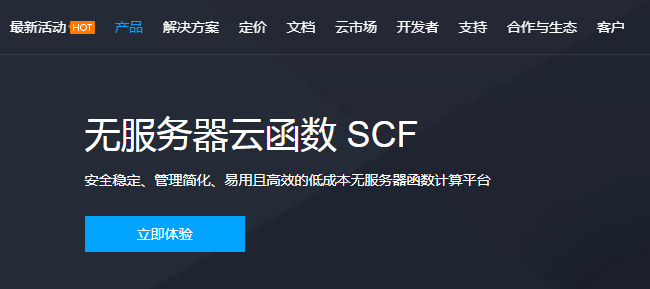

2. 函数服务-新建函数-空白函数

   > 后面如果想绑定自定义域名，只能绑定备案域名，所以刚开始新建函数的时候，我们最好选择香港地区，即从下图中的广州改为香港。
   > 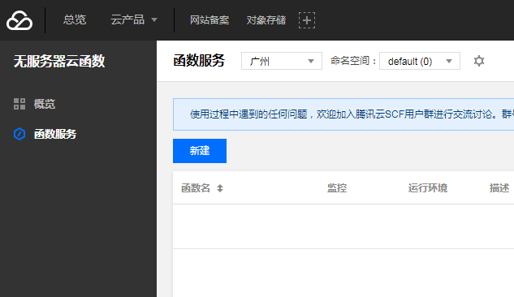

   模板选择空白。填写函数名称，注意以后会以这个名称将作网址且难以更改。运行环境选 PHP7.2。
   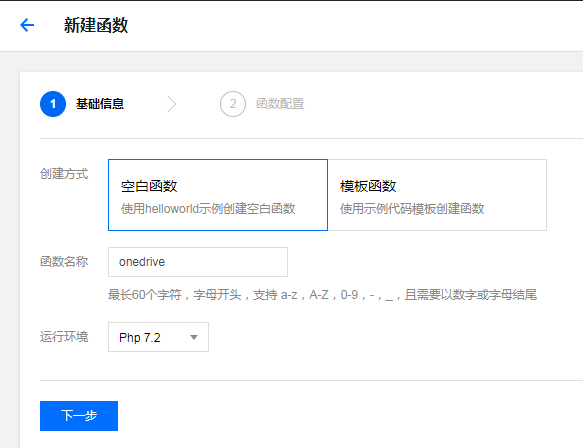

3. 函数配置

   可以修改一下描述，提交方式选择本地上传。

4. 下载函数源码并上传

   下载源码：[点击下载](https://sword.studio/go/aHR0cHM6Ly9naXRodWIuY29tL1RhaTdzeS9PbmVEcml2ZV9TQ0YvYXJjaGl2ZS9tYXN0ZXIuemlw)

   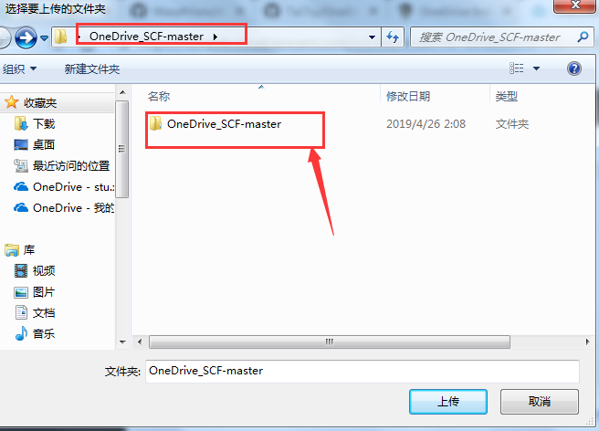

   > 博主在上传的时候因为是手机操作，所以先使用了压缩包的形式，结果提示错误。所以这里可能只能选择文件夹上传。

5. 添加触发方式

   修改触发方式，开启集成响应。

   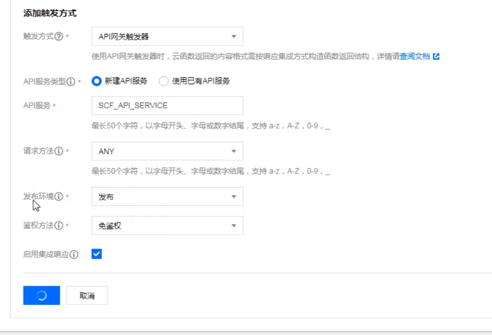

6. 进入网站，添加 API 密钥

   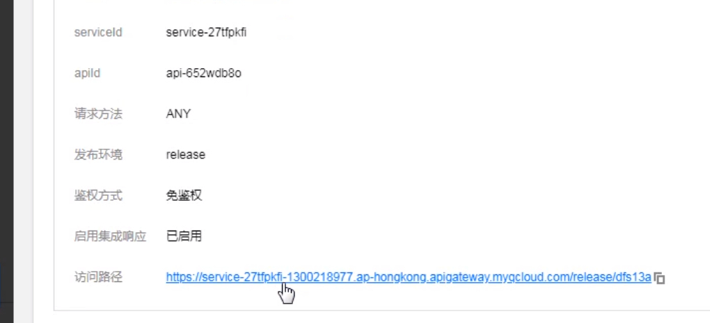

   选择中文，开始新建

   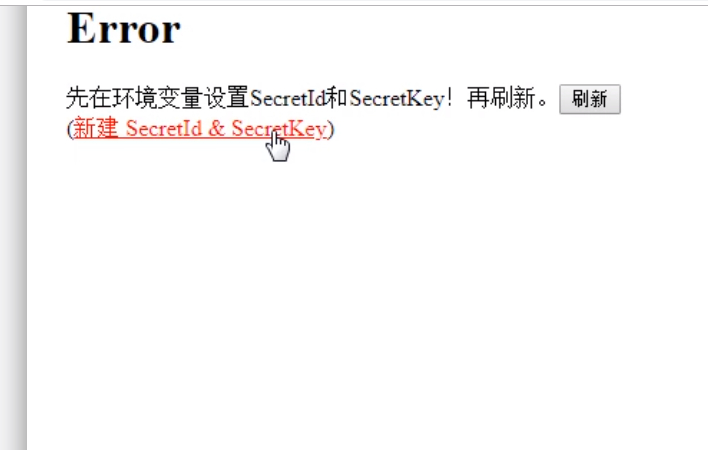

   接下来的窗口选择继续，然后新建密钥。

   回到函数配置，点击右上角的编辑，将获取的密钥粘贴入环境变量中。

   

   

7. 完成配置

   回到之前自己建的网站，如果没有错就可以继续下一步。选择 MS 默认。

   接下来会自动跳转到 OneDrive ，选择登录并继续，即可看到配置成功的界面。

   

   回到函数配置，点击右上角的编辑，环境变量中继续添加：key 为 admin ，value 为你要设置的密码。

   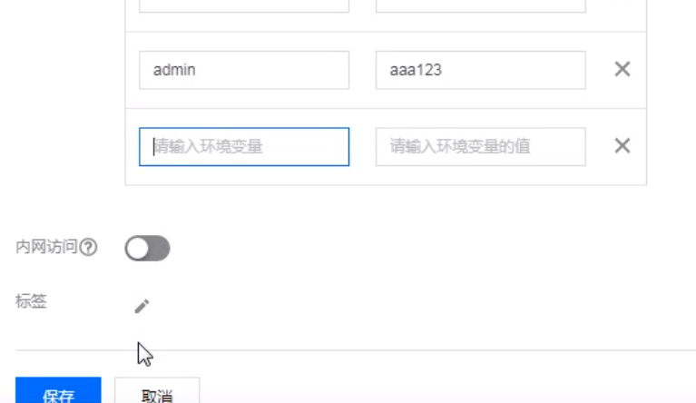

   回到网址，刷新后左上角就可以登录进入后台了。点击更新并在下方进行相应配置。这样就基本完工了！

## 定义域名

回到 API 网关，选择自定义域名，新建

为了得到最简链接，自定义路径设为 `/` `发布`

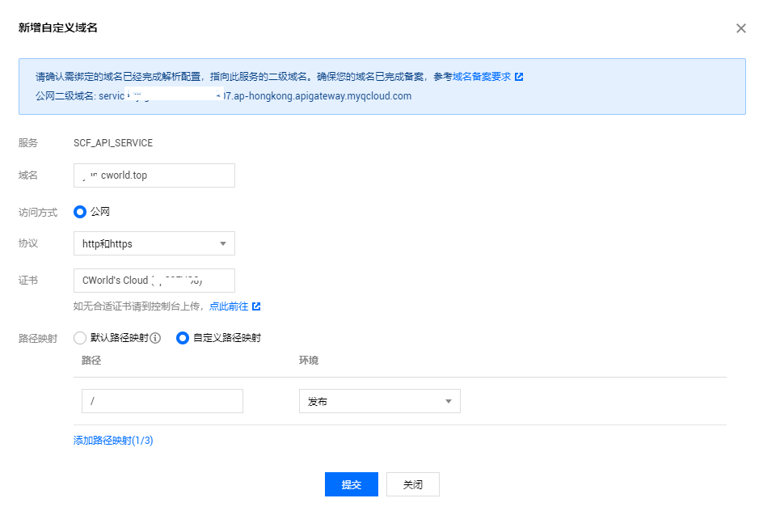

> 如果需要 https，点击“点此前往”，然后点击申请免费证书。注意证书和域名自定义都需要添加解析。
> 

添加蓝色提示框内的网站为 CNAME 解析。

访问链接即更换为：https://`你自己设置的域名`/`函数名`

## 进阶域名

最近腾讯改进出了更完美的方案，可以将上述的“/`函数名`”也去掉了。

作者发的视频链接：[使用自定义域名及其它设置](https://service-pgxgvop2-1258064400.ap-hongkong.apigateway.myqcloud.com/test/abcdef/%E4%BD%BF%E7%94%A8%E8%87%AA%E5%AE%9A%E4%B9%89%E5%9F%9F%E5%90%8D%E5%8F%8A%E5%85%B6%E5%AE%83%E8%AE%BE%E7%BD%AE.mp4?preview)

找到下图，点击服务名链接。

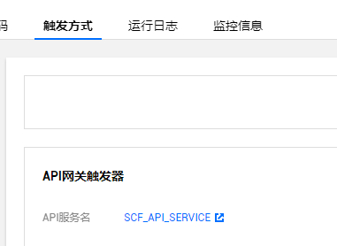

选择管理 API，点击右侧的编辑。


将路径改为“/”，点击下一步直到完成即可。然后根据提示点击发布。

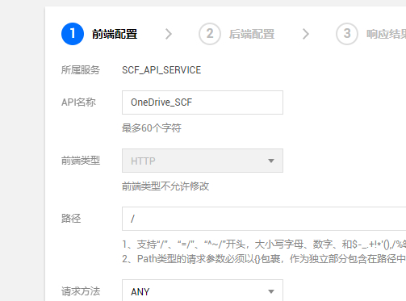

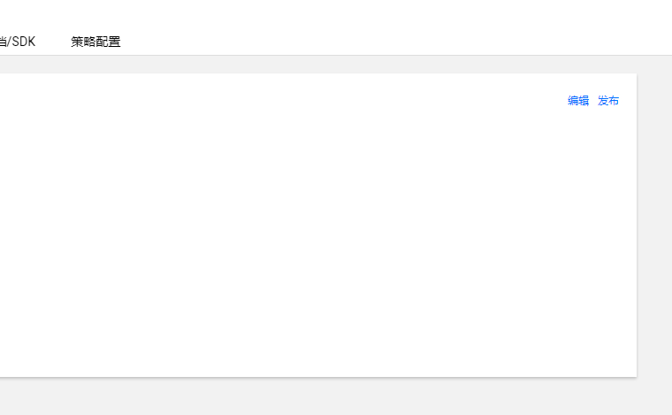

（看起来很像 git 代码托管平台的步骤）

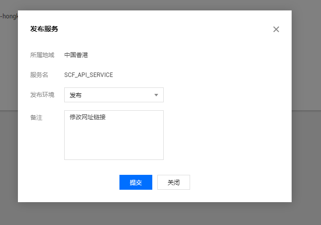

这时访问链接也终于更换为：https://`你自己设置的域名`

## 进阶美化

截图：

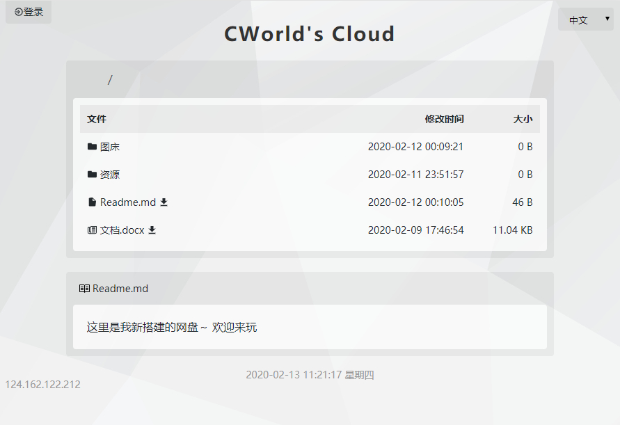

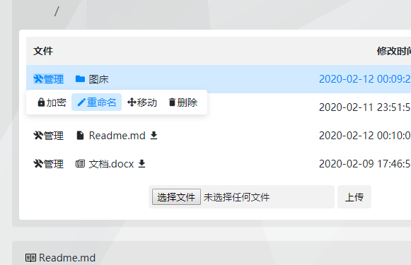

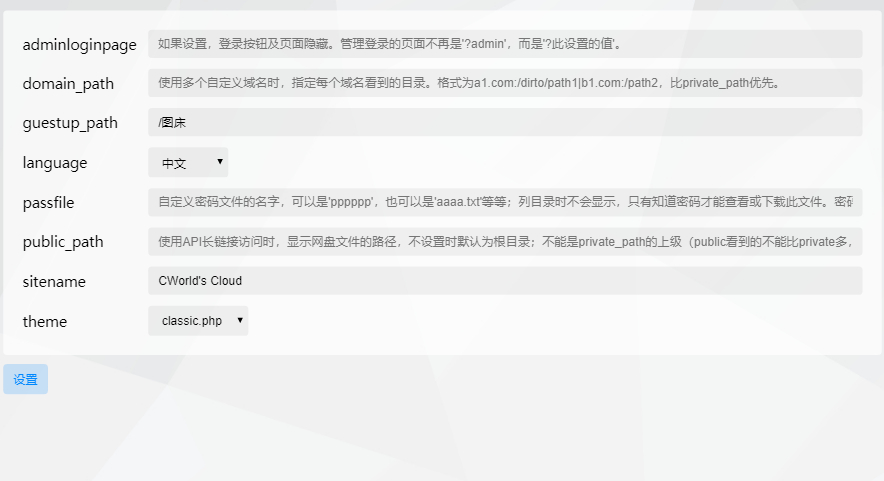

以下美化仅适用于 classic 主题。

> **日志**
> 设置界面失效。还未修复。

腾讯云的函数界面中找到函数代码，下方窗口中选择 theme 文件夹的 classic.php 。找到`</head>`前的`</style>`，在这行前面追加以下代码。然后点击保存即可。


代码：

```css
body{background:#DBDBDB !important;color:#000;font-family:Google Sans !important;}font{margin:39.5%;color:#989898;text-align:center;}a.login,body>div>li.operate{transition:.3s;…input#upload_submit{transition:.3s;border:none;border-radius:4px;background:#0000000d;padding:8px 11px;outline:none !important;}input#upload_submit:hover{background:#0088ff2e;color:#08f;}form[method="post"] table{background:#ffffffb5;border-radius:4px;border:none;padding:10px;border-spacing:10px;margin-bottom:10px;}form[method="post"] td{border:none;}form[method="post"] input,form[method="post"] select{transition:.3s;border:none;border-radius:4px;background:#0000000d;padding:8px 11px;outline:none !important;}form[method="post"] input[value="设置"]{background:#0088ff2e;color:#08f;}
```
